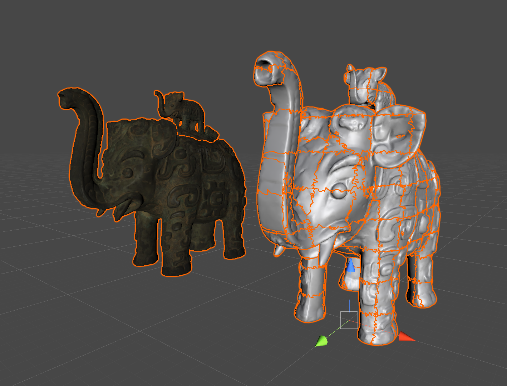

# MeshDivider
Simply Grid-base mesh dividing tool




# Installation

Add the following address to UnitPackageManager

```
https://github.com/fuqunaga/MeshDivider.git?path=Assets/MeshDivider
```


# Reference

[Lidded ritual ewer (huo) in the form of an elephant with masks and dragons](https://3d.si.edu/object/3d/lidded-ritual-ewer-huo-form-elephant-masks-and-dragons:d8c63598-4ebc-11ea-b77f-2e728ce88125)
